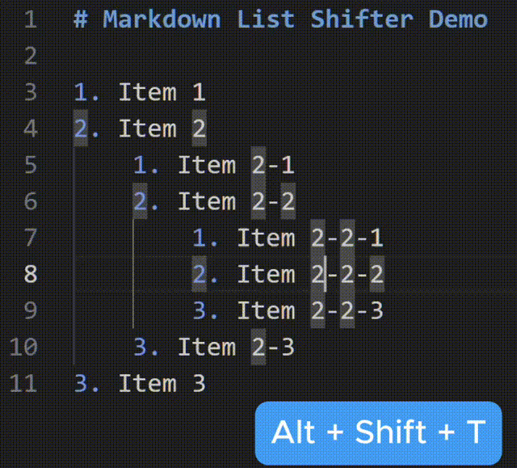

# Markdown List Shifter

Quickly switch between ordered and unordered Markdown lists at the current level.

## Usage

- **Keyboard Shortcut**: Toggle list type by pressing `Alt` + `Shift` + `T` while the cursor is inside a Markdown list.
- **Context Menu**: Right-click inside a list and select **"Toggle List Type (Ordered/Unordered)"**.

## Extension Settings

This extension contributes the following settings:

- `markdown-list-shifter.defaultUnorderedMarker`: Set the default marker for unordered lists (`-`, `*`, or `+`).

## License

MIT License